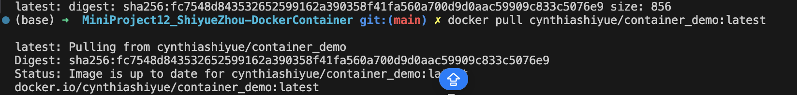
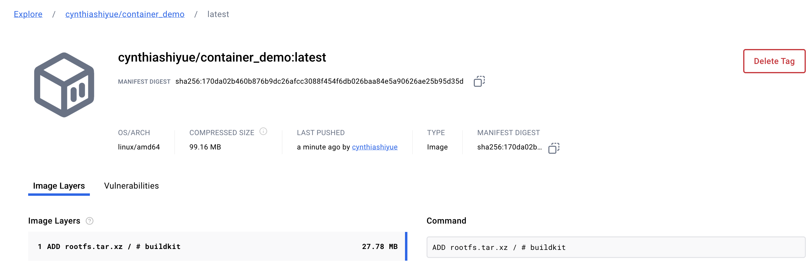
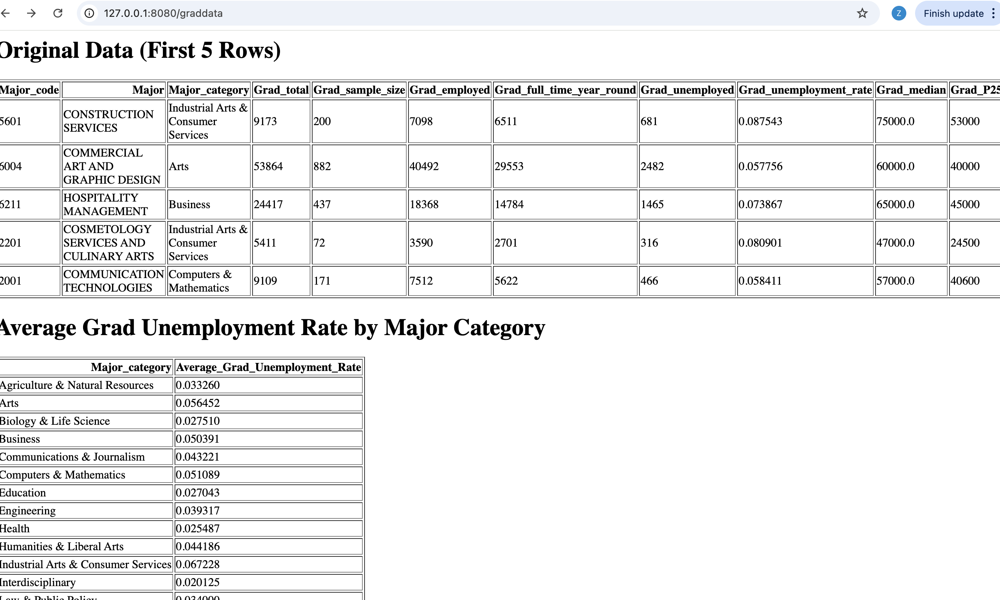

# MiniProject12_DockerContainer
[](https://github.com/nogibjj/MiniProject12_ShiyueZhou-DockerContainer/actions/workflows/cicd.yml)

# Docker Workflow Summary

## Overview
This workflow demonstrates how to containerize a Python Flask application and manage its lifecycle using Docker. The process includes building, running, and deploying the application in a Docker container, and integrating it into a CI/CD pipeline for automated image building and pushing to Docker Hub.

---

## 1. Dockerfile Setup
- **Purpose**: Defines the steps to containerize the Python Flask application.
- **Key Steps**:
  1. **Base Image**: Starts with a lightweight Python 3.9 image for efficiency.
  2. **Working Directory**: Sets `/app` as the container's working directory for organization.
  3. **Application Files**: Copies the Flask application and related files into the container.
  4. **Dependency Installation**: Installs required Python libraries using `requirements.txt`.
  5. **Port Exposure**: Exposes port `8080` to allow the Flask app to listen for requests.
  6. **Run Command**: Configures Flask to run the app on `http://0.0.0.0:8080`.

---

## 2. Workflow with Makefile
- **Purpose**: Automates Docker commands for managing the containerized application.
- **Key Commands**:
  1. **Build**: Creates a Docker image from the `Dockerfile`.
  2. **Stop Conflicting Containers**: Ensures port `8080` is available by stopping any running containers using it.
  3. **Run**: Launches a new container for the Flask application and maps it to port `8080`.
  4. **Push**: Tags and pushes the Docker image to Docker Hub.
  5. **Pull**: Retrieves the image from Docker Hub for deployment on another system.
  6. **Clean**: Removes the Docker image locally to free up space.
  7. **All**: Combines the entire workflow (build, stop conflicts, run, push, and pull) into one command for streamlined CI/CD integration.

---

## 3. Local Execution
To test the application locally:
1. **Build the Image**:
   ```bash
   make build
    ```
2. **Run the Container**:
   ```bash
   make run
    ```  






## Application Summary

### **1. Home**
- **URL**: [http://localhost:8080/](http://localhost:8080/)
- **Description**: Displays a simple "Hello, world!" message to verify the application is running.

---

### **2. Grad Data**
- **URL**: [http://localhost:8080/graddata](http://localhost:8080/graddata)  
  (Alternate: [http://127.0.0.1:8080/graddata](http://127.0.0.1:8080/graddata))
- **Data Source**: [FiveThirtyEight - Grad Students Data](https://github.com/fivethirtyeight/data/blob/master/college-majors/grad-students.csv)
- **Features**:
  - Displays the first 5 rows of the dataset.
  - Computes the average `Grad_unemployment_rate` grouped by `Major_category`.
- **Preview**:  
  

---

### **3. Stock Price**
- **URL**: [http://localhost:8080/stockprice](http://localhost:8080/stockprice)
- **Data Source**: Yahoo Finance.
- **Features**:
  - Enter a stock ticker (e.g., `UBS`) to fetch and display the current stock price.
  - Dynamically update the result for any valid stock ticker.
- **Preview**:  
  

---

### **Notes**
1. Ensure the Flask application is running to access these pages.
2. Replace `localhost` with the server's IP address if accessing from a remote device.
3. Required dependencies:
   - Flask
   - Pandas
   - Yahoo Finance API (via `yahoo_fin`)
4. Use the provided URLs to navigate through the application features.


## CI/CD Integration

### **Goal**
Automate the building and deployment of the Docker image in a CI/CD pipeline to streamline workflows and ensure consistency across environments.

### **Steps**
1. **Build Image**:
   - The CI/CD pipeline triggers the `build` step to create the Docker image from the `Dockerfile`.
   - Example:
     ```bash
     docker build -t <image_name> .
     ```

2. **Push to Registry**:
   - After building, the pipeline tags and pushes the image to a container registry like Docker Hub.
   - Example:
     ```bash
     docker tag <image_name> <dockerhub_username>/<image_name>:latest
     docker push <dockerhub_username>/<image_name>:latest
     ```

3. **Deployment**:
   - On deployment servers or cloud environments, the image is pulled from the registry and deployed.
   - Example:
     ```bash
     docker pull <dockerhub_username>/<image_name>:latest
     docker run -p 8080:8080 <dockerhub_username>/<image_name>
     ```

---

## Benefits

1. **Portability**:
   - Docker containers ensure the application runs consistently across different environments, eliminating the "it works on my machine" problem.

2. **Automation**:
   - The Makefile and CI/CD pipeline automate repetitive tasks, reducing manual effort and increasing productivity.

3. **Scalability**:
   - Docker images can be deployed on platforms like Kubernetes or Docker Swarm for seamless scaling in production environments.

4. **Efficiency**:
   - The `slim` Python base image reduces build size and improves the speed of deployments.

5. **Version Control**:
   - Docker images in registries allow for versioning, ensuring traceability of changes and rollbacks if needed.

---

## Usage Notes
- **Local Development**:
  - Use `make build` and `make run` to test the application locally.

- **Remote Deployment**:
  - Replace `localhost` with the server’s IP or domain to access the application remotely.

- **Dependencies**:
  - Ensure Docker, Python, and necessary libraries (e.g., Flask) are installed and compatible.

- **Full Workflow**:
  - Use `make all` to execute the entire workflow, from building the image to pushing it to Docker Hub.
